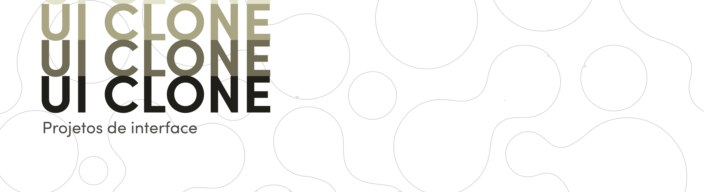
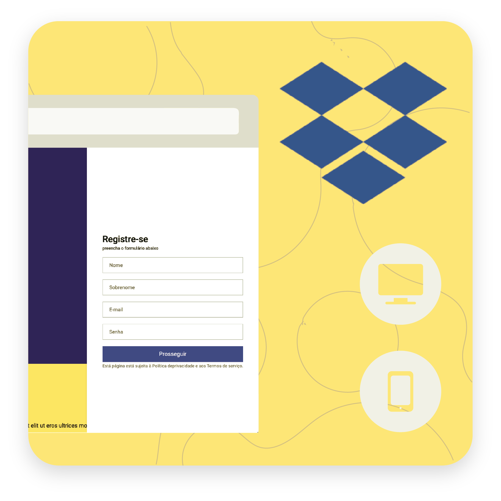
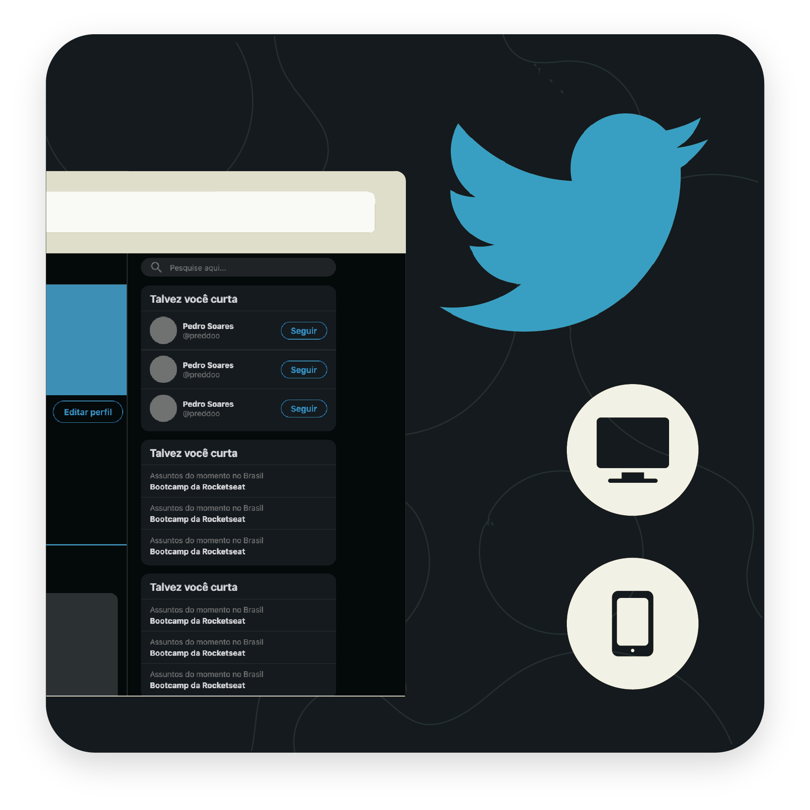
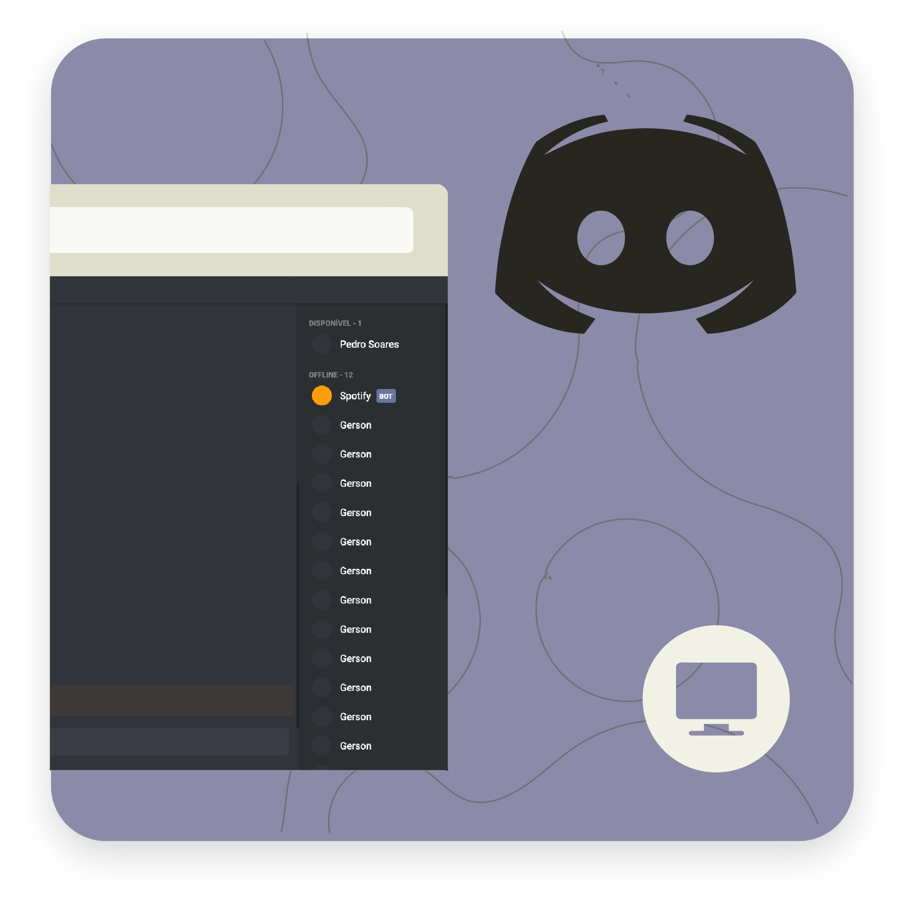
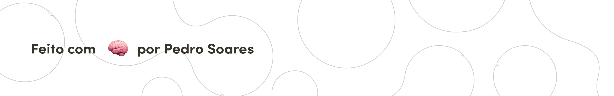

# **Objetivo**
O próposito desse repositório é armazenar todos os meus estudos de design de interface do usuário (UI), sempre mantendo-o atualizado. Dentro da pasta de cada projeto há uma descrição mais detalhada da implementação realizada em cada clone de interface.

# **Interfaces Reproduzidas**
### Clique para mais detalhes
<table>
  <tr>
    <td>
      
    </td>
    <td>
      
    </td>
    <td>
      
    </td>
    <td>
      
    </td>
  </tr> 
</table>

# Conhecimentos

Domínio sobre a construção de layouts com Flexbox e Grid.

