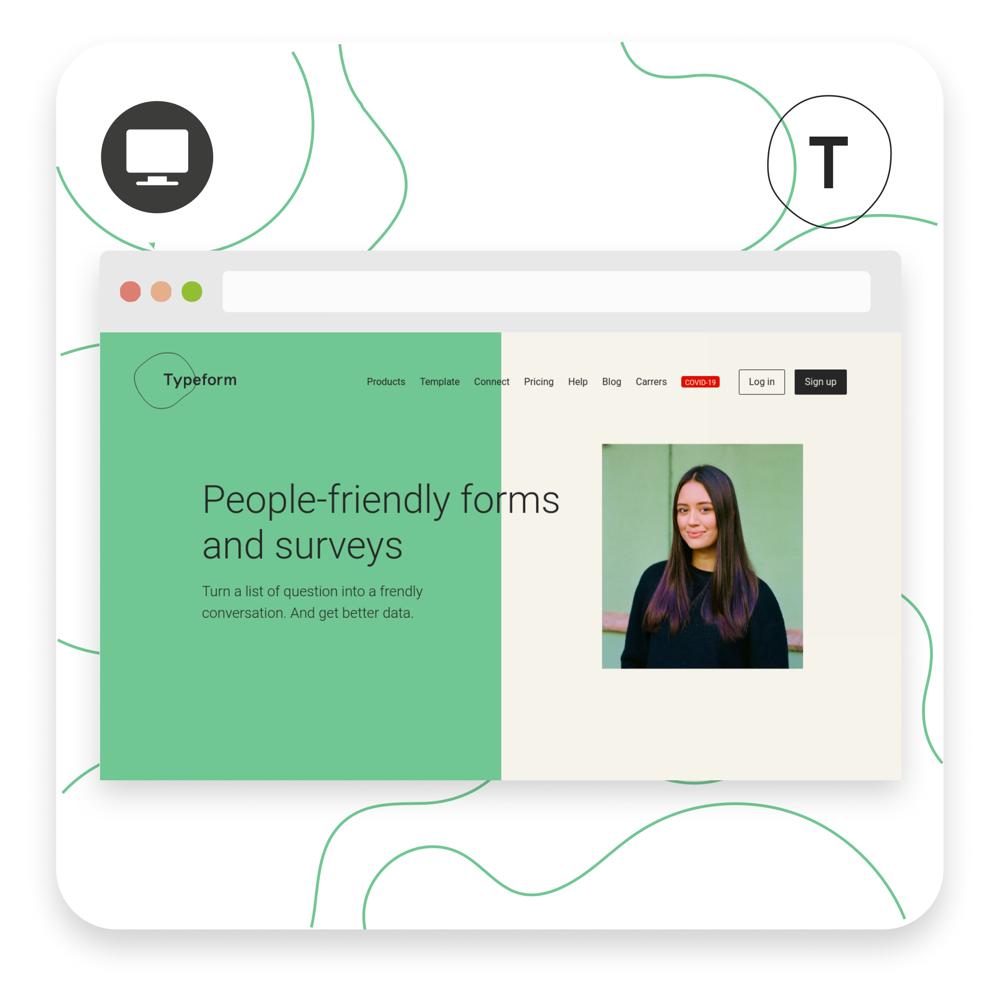
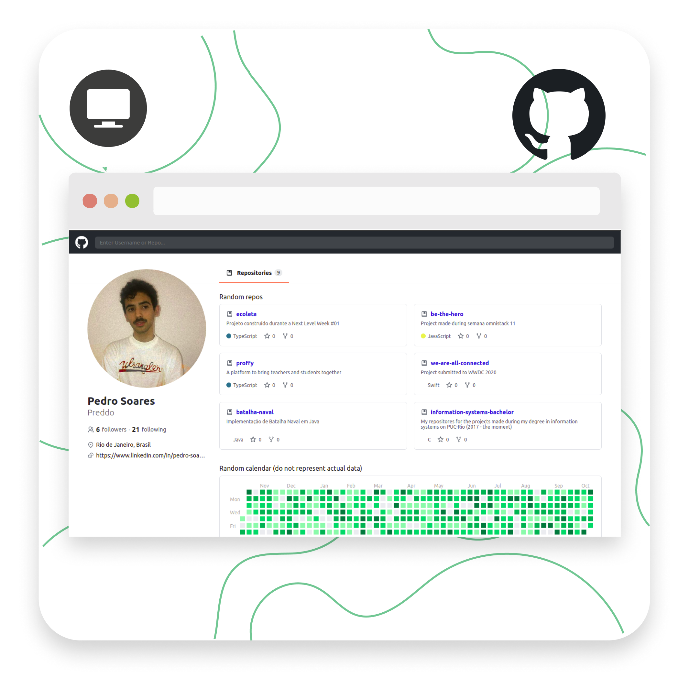
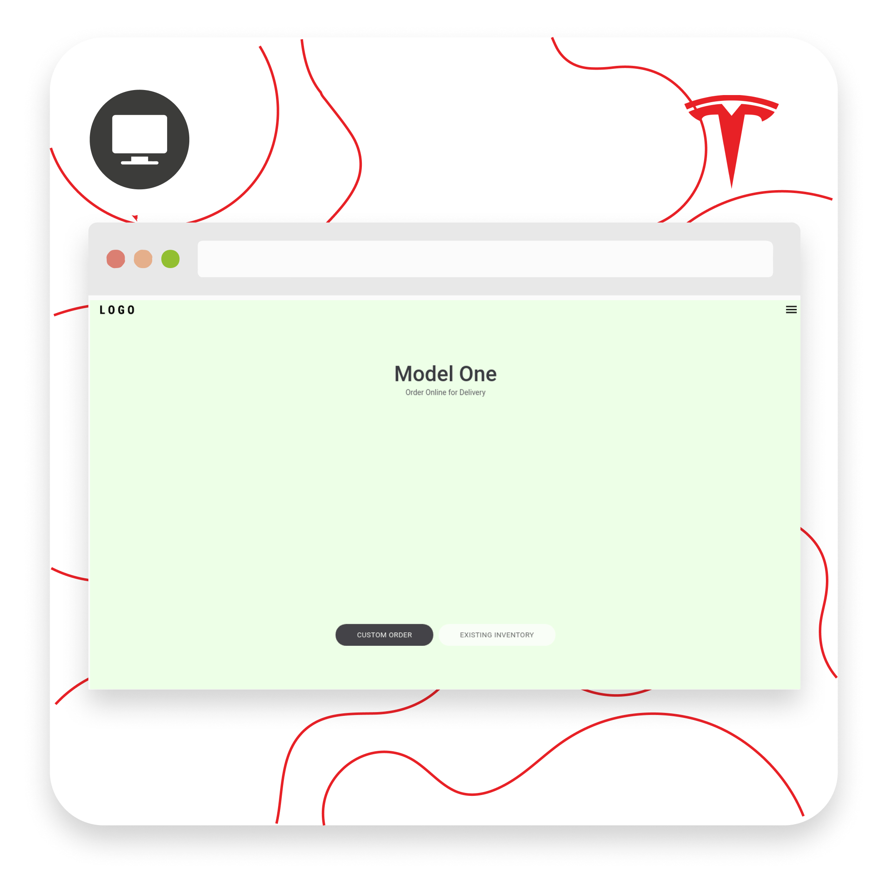
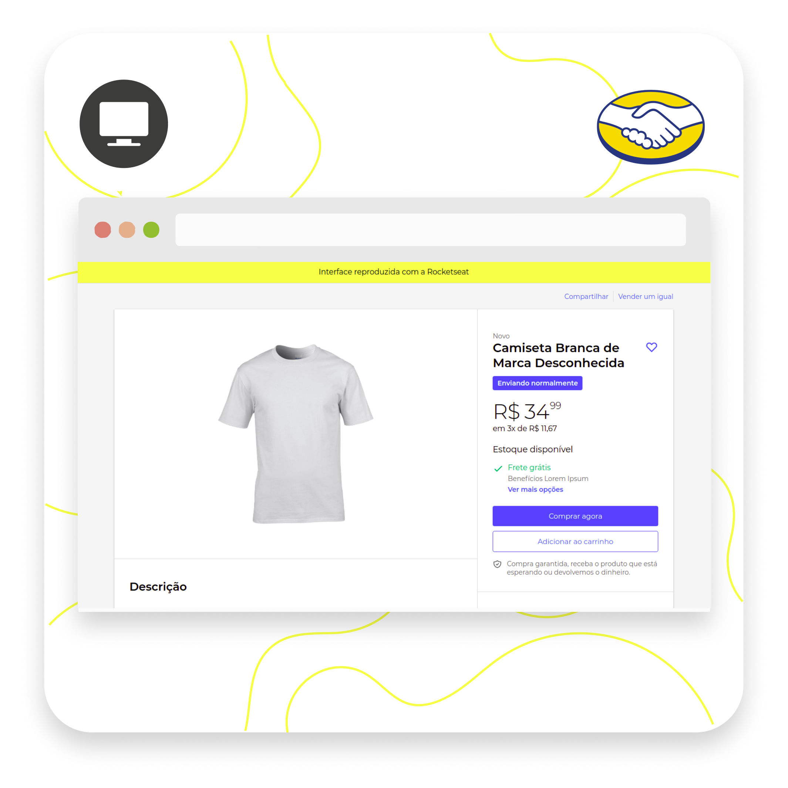
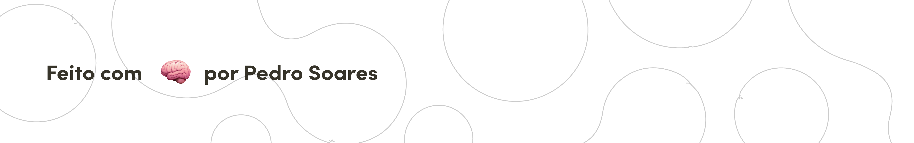

# Objetivo
O próposito desse repositório é armazenar todos os meus estudos de design de interface do usuário (UI), sempre mantendo-o atualizado. Dentro da pasta de cada projeto há uma descrição mais detalhada da implementação realizada em cada clone de interface.

# Interfaces Reproduzidas
### Clique para explorar em mais detalhes
<table>
  <tr>
    <td>
      
    </td>
    <td>
      
    </td>
    <td>
      
    </td>
    <td>
      
    </td>
  </tr>
  <tr>
    <td>
      
    </td>
    <td>
      
    </td>
    <td>
      
    </td>
    <td>
      
    </td>
  </tr> 
</table>

## Conhecimentos

Domínio sobre a construção de aplicações web (sites SPA) com conhecimentos de layout Flexbox e Grid; estilização com CSS; elaboração de animações com CSS e React Spring; construção de formulários e validação de campos; manipulação do localStorage para, entre outras coisas, controlar a sessão de um usuário; implementação de Shimmer Effect para carregamento de páginas;

## Tecnologias conhecidas

* HTML5
* CSS3
* Javascript
* ReactJS
* Framer Motion
* React Native
* Storybook
* NextJS

## Plataformas de hospedagem

* Netlify
* Vercel
* Heroku

